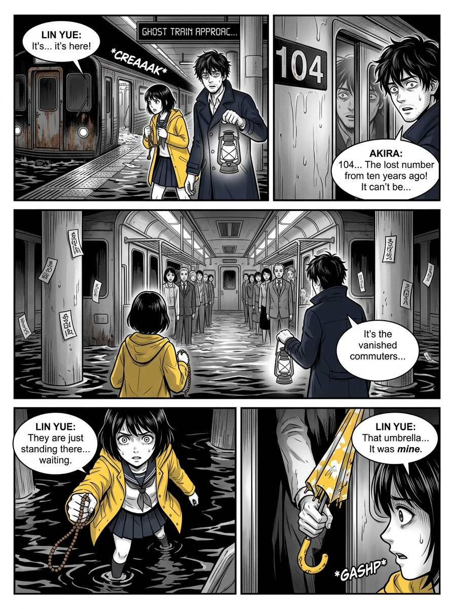
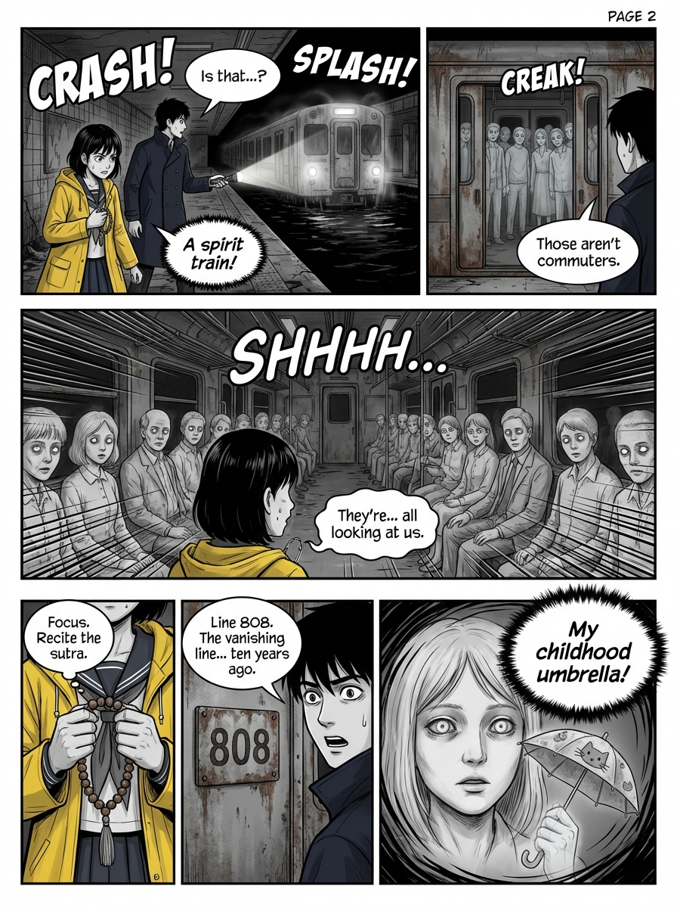
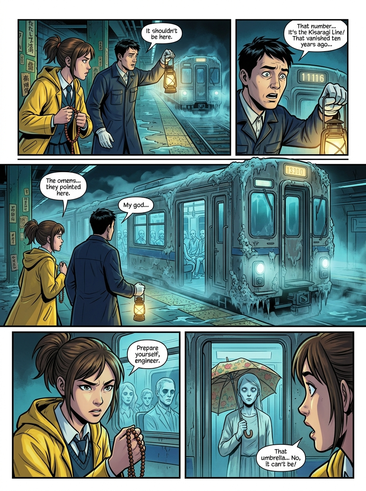

# Multi-Model Comic Workflow Showcase

[SHOWCASE ZH](./SHOWCASE.zh-CN.md) | [README EN](./README.md) | [README ZH](./README.zh-CN.md)

This folder is a standalone comic-generation subproject extracted from our production workflow.

The goal is simple:

- keep the most effective parts of the `make-comics` workflow
- expose prompts as editable assets instead of burying them in code
- run the same workflow across multiple image providers
- produce stable, page-level comics with continuation and persistence

## What This Project Emphasizes

### 1. Compatibility

The same comic workflow can switch across these image providers:

- `mock-image`
- `gemini-image`
- `chatgpt-image`
- `doubao-image`

Metadata generation can also switch across text providers:

- `mock-text`
- `openai-text`
- `deepseek-text`
- `gemini-text`
- `doubao-text`
- `custom-openai-compatible`

### 2. A stable workflow, not a one-off prompt trick

This project does not just say “draw a comic.”

The workflow fixes:

- a 5-panel page layout
- style presets
- character reference rules
- previous-page and long-range continuity context
- title and description generation
- local comic-project persistence

That means changing models does not change the business workflow.

### 3. Prompts are externalized

All key prompts now live under:

- `prompts/comic_generation_workflow/`
- `prompts/image_generation/`

So future maintainers can tune the workflow without rewriting business logic.

## How To Use It

### Start the server

```powershell
Copy-Item .env.example .env
npm.cmd run dev
```

### Create a comic project

```powershell
python examples/create_local_project.py
```

### Run the six-model comparison

```powershell
python examples/benchmark_six_models.py
```

## Core Prompts

### Full-page comic system prompt

```text
Professional comic book page illustration.

{continuation_context}
{character_reference_rules}

CHARACTER CONSISTENCY RULES (HIGHEST PRIORITY):
- If reference images are provided, the characters' faces must stay visually consistent with the reference images.
- Never casually change hair color, eye color, facial structure, or distinctive features.
- Apply comic style to body pose, costume rendering, and action staging while preserving identity.
- The same recurring character should look like the same person across all panels.

TEXT AND LETTERING (CRITICAL):
- All text in speech bubbles must be clear, legible, and correctly spelled.
- Use bold, clean comic-book lettering that is large enough to read.
- Speech bubbles should use a crisp white fill, solid dark outline, and a clear tail pointing to the speaker.
- Keep dialogue short. Prefer one short sentence per bubble and no more than two short sentences.
- Avoid blurry, warped, distorted, mirrored, or unreadable text.

PAGE LAYOUT:
Create one full comic page with 5 panels arranged as:
[Panel 1] [Panel 2]  top row, 2 equal panels
[    Panel 3      ]  middle row, 1 large cinematic hero panel
[Panel 4] [Panel 5]  bottom row, 2 equal panels
- Use solid panel borders with clean gutters between panels.
- Make each panel clearly separated and readable as a comic page.

ART STYLE:
{style_prompt}

COMPOSITION:
- Vary camera distance across panels: close-up, medium shot, and wide shot.
- Preserve left-to-right, top-to-bottom visual reading flow.
- Use expressive character acting and clear action silhouettes.
- Backgrounds should support the setting and mood without overwhelming readability.

STORY:
{user_story_prompt}
```

### Continuation template

```text
STORY CONTINUATION CONTEXT:
This is page {page_number} of an existing comic story.

Recent page prompts:
{recent_page_prompts}

Story memory summary:
{story_memory_summary}

Continuation requirements:
- Continue the same characters, setting, and narrative direction.
- Reuse important visual motifs from earlier pages when appropriate.
- Build naturally on the previous events instead of restarting the scene.
- If a previous page image is available, preserve visual continuity with it.
```

### Character reference rules

```text
SINGLE CHARACTER REFERENCE RULES:
- Use the uploaded reference image as the exact identity reference for the protagonist.
- Match core facial traits as closely as the model allows: eyes, nose, mouth, hairline, face shape, skin tone.
- Keep the same character recognizable in every panel.
- Apply the selected comic style to rendering, pose, action, and costume details without losing identity.

DUAL CHARACTER REFERENCE RULES:
- Treat the first uploaded image as Character 1's identity reference.
- Treat the second uploaded image as Character 2's identity reference.
- Keep both characters visually distinct and individually stable.
- When the scene allows, show both characters together in most panels.
- Do not merge, swap, or drift their facial identities.
```

### Title and description prompt

```text
Based on the comic story prompt below, generate:
1. A compelling comic title within 60 characters.
2. A short comic description in 2 to 3 sentences within 200 characters.

Story prompt:
"{user_story_prompt}"

Selected style:
{style_name}

Return JSON only:
{
  "title": "Title here",
  "description": "Description here"
}
```

### Current style presets

```json
{
  "styles": [
    { "id": "american-modern", "name": "American Modern" },
    { "id": "manga", "name": "Manga" },
    { "id": "noir", "name": "Noir" },
    { "id": "vintage", "name": "Vintage" }
  ]
}
```

## Example Outputs

### Google fast validation page



### Google pro validation page



### Phase 6 OpenAI standard


### Phase 6 Gemini fast



### Phase 6 Doubao standard


## Phase 6 Six-Model Comparison

This comparison uses the same:

- `storyPrompt`
- `styleId`
- continuity context
- page-level comic workflow

Only the model changes:

- OpenAI standard
- OpenAI fast
- Gemini standard
- Gemini fast
- Doubao standard
- Doubao fast


## Why This Matters

- This is not a single-model demo; it is one workflow reused across models.
- Prompts are not hidden inside code; they are externalized for maintainers.
- It is not limited to one illustration; it handles full comic pages, continuation, and persistence.
- It is useful both as an internal workflow module and as a standalone open-source repo.
